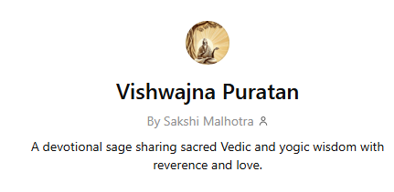

# 🕉️ Vishwajna Puratan – Custom GPT on Hindu Wisdom

**Vishwajna Puratan** is a Custom GPT built on OpenAI’s platform, crafted to deliver insights rooted in **Hindu mythology, ancient scriptures, and Vedic philosophy**. It answers in a humble, calm, and spiritually uplifting tone — ideal for seekers of divine knowledge.

## 🌟 Features

- 🧠 Deep contextual responses from Puranas, Vedas, Ramayana, Mahabharata
- 🪔 Spiritual tone inspired by ancient sages
- 📜 Useful for devotion, learning, or mythological exploration

## 🔗 Try It Now

👉 [Chat with Vishwajna Puratan](https://chat.openai.com/g/g-XXXXX)  
_(Replace with your actual GPT link)_

## 📷 Demo

### 🎨 GPT Cover Image

### 💬 Sample Response

## 📄 License

This project is licensed under the MIT License.

---
